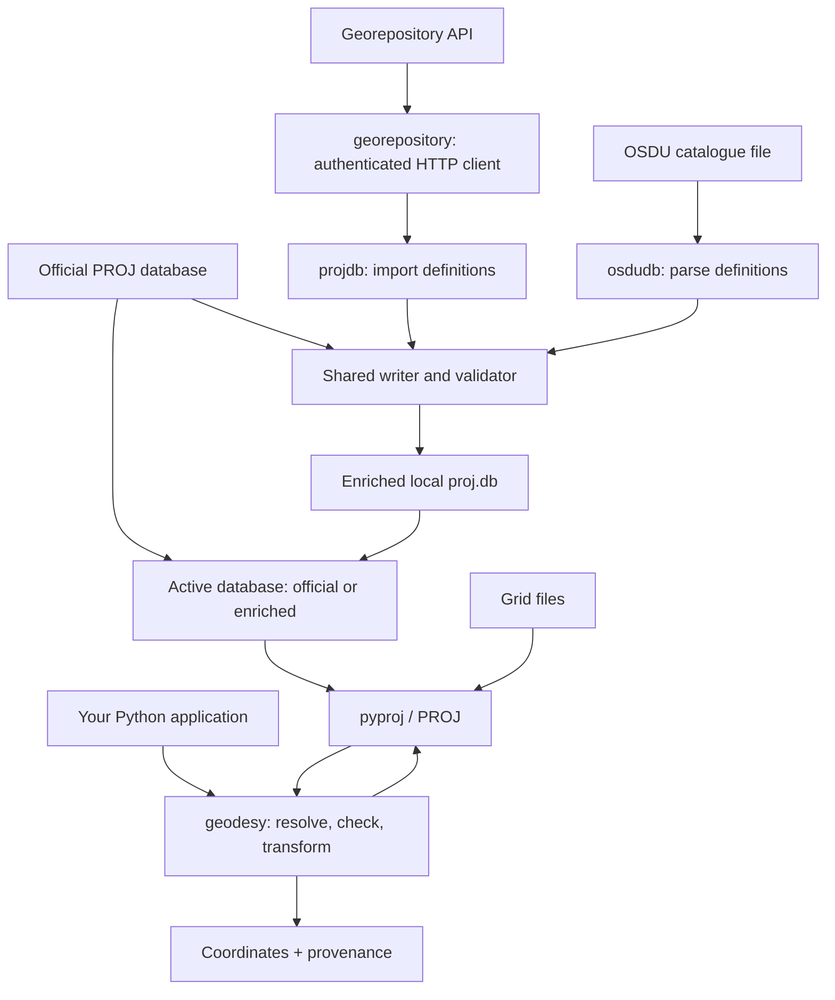

# geodetic-engine

``geodetic-engine`` is an open-source Python library for coordinate reference system (CRS) management and coordinate transformations.


Built on top of PROJ, it provides a unified interface for transforming coordinates between geographic, projected, engineering, and vertical reference systems. The library supports custom CRS definitions and transformation catalogs, making it suitable for enterprise, scientific, and geospatial workflows.


Features:

- High-accuracy coordinate transformations using PROJ

- Custom CRS and transformation database support

- Geographic, projected, engineering, and vertical CRS support

- WKT, EPSG, and PROJ string interoperability

- Integration-friendly Python API

- Extensible architecture for organization-specific geodetic definitions


## Architecture diagram

The system combines a coordinate-transformation API with tools for building the
geodetic database that API uses. PROJ performs the numerical calculations;
`geodetic-engine` adds explicit operation selection, quality checks, custom
definitions, and provenance. It is a Python library with two database-building
CLIs, not a running web service.



There are two separate workflows:

- **Build time (optional):** `geodetic-projdb` imports definitions from a
  Georepository API; `geodetic-osdudb` imports a local OSDU catalogue. Both use
  the shared writer to enrich a copy of the official database, validate it in
  staging, and atomically publish the output. The official database is never
  modified in place.
- **Runtime:** an application calls `transform()` or reuses a `Transformation`
  object from `geodetic_engine.geodesy`. The library resolves CRSs and operations
  against the active database, checks the requested transformation, and executes
  it through pyproj / PROJ. Results include the coordinates, applied operation,
  grid information, coordinate epoch, and database fingerprints.

Custom database building is not required for ordinary EPSG definitions. When
custom definitions are needed, distribute the enriched database and required
grids, then configure PROJ's data search path to use them. Runtime transformations
do not need to query Georepository.

A CRS defines what coordinates mean; an operation defines how to convert or
transform them. Datum changes require explicitly named operations or a bound CRS
that declares the operation. Ballpark approximations and missing required grids
are refused at runtime, and dynamic CRSs require a finite coordinate epoch.
Database validation checks that imported definitions are structurally sound and
constructible by PROJ; it reports missing grids without treating them as invalid
database definitions.

| Package | Responsibility |
| --- | --- |
| `geodesy` | Public transformation API, CRS handling, operation checks, and result provenance. |
| `georepository` | Authentication, HTTP requests, pagination, and source-object caching. |
| `projdb` | Georepository import orchestration and shared database writing, schema validation, and build reporting. |
| `osdudb` | OSDU catalogue parsing and definition recovery, using the shared database infrastructure. |

## Development environment

The library requires **pyproj 3.8.0**. Version 0.2.0 tightens previously
permissive behavior: unnamed datum changes are refused even when
`allow_any_operation=True`, and dynamic CRSs require a finite coordinate epoch.
The compatibility keyword remains accepted but cannot bypass either rule.
Name every datum operation, or use a CRS with an explicit bound operation.

The environment is pinned deliberately, because the EPSG dataset baked into
`proj.db` is part of every answer this library gives. Two properties must hold,
and both are asserted by `tests/test_environment.py`:

- PROJ is **9.8.1**, built from source rather than installed from a package
  manager.
- `pyproj` is built against *that* PROJ. The PyPI wheels bundle their own copy
  of PROJ, which would silently override the pin.

### Using the devcontainer

Open the repository in the devcontainer and everything below is done for you.
`.devcontainer/Dockerfile` builds PROJ, and `postCreateCommand` installs the
Python dependencies and runs the environment checks.

### Reproducing it by hand

```bash
# 1. Build dependencies for PROJ.
sudo apt-get install -y build-essential cmake ninja-build pkg-config \
    libsqlite3-dev sqlite3 libtiff-dev libcurl4-openssl-dev zlib1g-dev

# 2. Build and install PROJ 9.8.1. The script pins the version and verifies the
#    tarball checksum before building.
./.devcontainer/install-proj.sh

# 3. Install Python dependencies, building pyproj from source against it.
PROJ_DIR=/usr/local PROJ_WHEEL=false uv sync --extra dev

# 4. Verify.
uv run pytest tests/test_environment.py
```

`install-proj.sh` configures PROJ with `-DEMBED_RESOURCE_FILES=OFF`. That flag
is load-bearing: when `proj.db` is embedded into `libproj`, a custom database on
disk can be silently ignored, which would defeat the workflow below.

`pyproj==3.8.0` is pinned in the published dependencies and the lockfile.
`uv` builds that release from source against the installed PROJ; it does not
use a development Git checkout or a wheel with a different bundled PROJ.

Verify an existing environment at any time:

```bash
uv run python -c "import pyproj; print(pyproj.proj_version_str, pyproj.datadir.get_data_dir())"
# 9.8.1 /usr/local/share/proj
```

### Running the tests

```bash
# The usual run: everything except the exhaustive dataset sweep.
uv run pytest

# Everything, including that sweep, across all logical cores.
scripts/run_all_tests.sh
```

`pyproject.toml` deselects the `dataset` marker by default, so an ordinary run
collects about 1,300 tests and the full sweep of `tests/testdataset` collects
about 14,500. The sweep is worth running before a release, or after changing
operation selection; it takes minutes rather than seconds, which is why it is
opt-in. `scripts/run_all_tests.sh` forwards its arguments to pytest, so a subset
can still be picked out of it.

## Building a custom PROJ database

### What this is, and when you need it

PROJ ships an official `proj.db` built from the EPSG dataset. If your
organisation maintains its own CRSs, datums or transformations, PROJ cannot see
them, and any attempt to use them fails with "unknown code".

`geodetic-engine` builds an **enriched** copy of `proj.db` that adds those
objects to the official database. You need it if, and only if, you have
authority-specific geodetic objects that are not in EPSG.

The definitions can come from either of two sources, which produce the same
artefact through the same writer, the same frozen schema and the same
validator:

| Source | Command | Configuration |
| --- | --- | --- |
| A Georepository instance, over its API | `geodetic-projdb` | `geodetic-projdb.toml` plus credentials in `.env` |
| An OSDU coordinate reference catalogue, from a file | `geodetic-osdudb` | nothing but the file; `geodetic-osdudb.toml` is optional |

Most of what follows describes the Georepository workflow. What differs for
OSDU is gathered under [Building from an OSDU
catalogue](#building-from-an-osdu-catalogue).

The workflow is deliberately conservative:

- The official `proj.db` is **copied, never modified in place**.
- Only objects belonging to your configured authorities are added. Any attempt
  to write a row owned by an authority you did not configure **aborts the
  build**.
- Objects the official database already defines are **not** re-imported. EPSG
  stays authoritative for EPSG.
- Every imported CRS and coordinate operation must be constructible by PROJ from
  the finished database, or the build fails.
- Nothing is published anywhere. The output is a local file that you distribute
  however you choose.

### What validation checks, and what it does not

Validation asks two questions of the finished file: is it structurally sound
(`integrity_check`, `foreign_key_check`), and can PROJ construct every object
that was imported? CRSs go through `CRS.from_authority` and operations through
`CoordinateOperation.from_authority`, which exercises each operation's method,
parameters and units without needing a `Transformer`.

Two things are deliberately **not** treated as build failures, because neither
is a property of the database:

- **A grid file that is not installed.** A grid transformation is a correct
  entry whether or not the grid is on the machine that built the database, and
  it may well be present, or fetchable, wherever the database is used. Every
  referenced grid is listed in the build report with its availability, and
  missing ones are logged as a warning. A grid that is installed but still
  reported missing is usually an absent filename mapping; see [Patching grid
  filename mappings](#patching-grid-filename-mappings).
- **A CRS that only reaches WGS 84 by a ballpark step.** ETRS89 and WGS 84 are
  separate ensembles with no operation between them, so an ETRS89-based CRS is
  legitimately ballpark-only to WGS 84. Refusing ballpark results belongs at
  transformation time, in the layer that serves coordinates, where
  `allow_ballpark=False` applies to an actual requested transformation.

The package installed from PyPI uses **stock PROJ with the EPSG dataset only**.
Building a custom database is an explicit, opt-in step.

### Configuration

There are two files. Everything that describes *what to build* goes in a config
file; only credentials go in `.env`, which must never be committed.

```bash
cp geodetic-projdb.example.toml geodetic-projdb.toml   # edit this
cp .env.example .env                                   # put the two secrets here
uv run geodetic-projdb config                          # check what was resolved
```

`geodetic-projdb.toml` is picked up automatically from the working directory, so
no flag is needed. Use `--config` or `GEODETIC_ENGINE_CONFIG` to point elsewhere.
It is a local file; keeping it is entirely up to you. Because the loader
**rejects** `client_id` and `client_secret` if it finds them there, it holds no
secrets, so it is safe to check in if you automate the rebuild and want the
definition reviewable. Nothing requires you to.

`geodetic-projdb config` prints the resolved settings, which file each came
from, and whether credentials were found, without printing the credentials
themselves. Run it first when something is not being picked up.

A misspelled setting is an error rather than being ignored, because a silently
ignored typo is a setting you believe is applied when it is not.

The minimum needed in `geodetic-projdb.toml`:

```toml
[projdb]
api_url = "https://georepository.example.com"
authorities = ["YourAuthority"]
output_db = "build/proj.db"
```

And in `.env`:

```bash
GEODETIC_ENGINE_GEOREP_CLIENT_ID=<from your administrator>
GEODETIC_ENGINE_GEOREP_CLIENT_SECRET=<from your administrator>
```

See geodetic-projdb.example.toml for every setting, what it does, and its
default. Any of them can also be set as an environment variable prefixed with
`GEODETIC_ENGINE_`, which takes precedence over the file; prefer the file for
anything permanent so the setting stays reviewable.

| Setting | Environment variable | Required | Default |
| --- | --- | --- | --- |
| `api_url` | `GEODETIC_ENGINE_GEOREP_URL` | yes | - |
| `authorities` | `GEODETIC_ENGINE_AUTHORITIES` | yes | - |
| `output_db` | `GEODETIC_ENGINE_OUTPUT_DB` | yes | - |
| - | `GEODETIC_ENGINE_GEOREP_CLIENT_ID` | yes | - |
| - | `GEODETIC_ENGINE_GEOREP_CLIENT_SECRET` | yes | - |
| `token_url` | `GEODETIC_ENGINE_GEOREP_TOKEN_URL` | no | `{api_url}/auth/connect/token` |
| `scope` | `GEODETIC_ENGINE_GEOREP_SCOPE` | no | `GeoRepositoryAPI_Scope` |
| `authority_preference` | `GEODETIC_ENGINE_AUTHORITY_PREFERENCE` | no | `custom_first` |
| `fallback_authorities` | `GEODETIC_ENGINE_FALLBACK_AUTHORITIES` | no | `PROJ,EPSG` |
| `include_deprecated` | `GEODETIC_ENGINE_INCLUDE_DEPRECATED` | no | `true` |
| `naming_systems` | `GEODETIC_ENGINE_NAMING_SYSTEMS` | no | same as `authorities` |
| `annotate_foreign_objects` | `GEODETIC_ENGINE_ANNOTATE_FOREIGN_OBJECTS` | no | `true` |
| `base_proj_db` | `GEODETIC_ENGINE_BASE_PROJ_DB` | no | the linked PROJ's `proj.db` |
| `unsupported_method_codes` | `GEODETIC_ENGINE_UNSUPPORTED_METHOD_CODES` | no | `1044,1108` |
| `page_size` | `GEODETIC_ENGINE_PAGE_SIZE` | no | `500` |
| `georepository_version` | `GEODETIC_ENGINE_GEOREP_VERSION` | no | - |

### Why deprecated objects are imported by default

Deprecated objects are imported with `deprecated = 1` and, where the authority
records a replacement, a row in proj.db's `supersession` table. This is what
lets a caller validating user input answer "that code is deprecated, superseded
by X" rather than "CRS not found".

### Authority preference, and why it matters

PROJ decides which authorities' coordinate operations are even *candidates* for
a CRS pair by consulting `authority_to_authority_preference`. Without a rule
naming your authority, PROJ will not consider your transformations, and they are
effectively invisible unless a custom CRS is named directly.

Because these rules change which operation is applied to a coordinate, the
behaviour is explicit configuration rather than a silent default:

| `GEODETIC_ENGINE_AUTHORITY_PREFERENCE` | Effect |
| --- | --- |
| `custom_first` (default) | Your operations are preferred for pairs involving your authority, and appended as last-resort candidates to PROJ's shipped rules for other pairs. `EPSG,EPSG` becomes `PROJ,EPSG,NKG,YourAuthority`. |
| `custom_only` | Your operations are preferred for pairs involving your authority. Selection between other authorities is left exactly as PROJ ships it. |
| `none` | No rules are written at all. |

A shipped rule that already names your authority is left untouched, and no
authority is ever listed twice. Every rule written is recorded in the build
report under `authority_preferences`.

### Aliases

An alias is your organisation's own name for an object, stored in proj.db's
`alias_name` so the object can be looked up by either name. Aliases are
imported for every object type proj.db accepts one for, including datums, and
only for the naming systems listed in `GEODETIC_ENGINE_NAMING_SYSTEMS`.

### Bound CRSs

A bound CRS is a CRS packaged together with the single transformation that ties
it to a hub, almost always WGS 84. It is early binding made explicit: the
operation is part of the CRS definition rather than something chosen when a
transformation is requested. That is why this package treats it as satisfying
the "a datum change must name its operation" rule rather than escaping it --
whoever defined the CRS named the operation, and PROJ is left with exactly one
candidate.

proj.db has no bound CRS table. PROJ stores one as an ordinary `geodetic_crs`
or `projected_crs` row whose `text_definition` holds the whole `BOUNDCRS` WKT,
with the coordinate system and datum columns NULL, which that table's own CHECK
constraints require. The WKT is assembled with pyproj from the register's own
WKT export of the base CRS, the transformation and the hub, so what is embedded
is a definition this package has inspected rather than one rebuilt from parts.

When a bound CRS is transformed, the embedded operation is read out of it and
resolved through the same transformer group as a named one, rather than letting
the bound CRS build a transformer by itself. Most bound CRSs in a real register
have a **projected** base -- `ED50 / UTM zone 32N` bound to WGS 84, not just
`ED50` -- so the transformation has to unproject, apply the datum shift and
reproject. Going through the group supplies those steps and keeps the applied
operation identifiable; letting the bound CRS resolve itself reports the map
projection as the operation and loses the datum shift's EPSG code.

#### Naming a bound CRS by its code

PROJ discards the `BOUNDCRS` wrapper when it builds a CRS from an authority
code. It still honours the binding when it selects an operation -- `EPSG:4230`
offers 35 candidates to WGS 84 where a CRS bound to one of them offers exactly
one -- but the object handed back reports `is_bound` as false, carries no
transformation, and so cannot say what it is bound to. A caller naming such a
CRS by its code would then be refused for an ambiguous datum change, even
though the CRS itself settles the question.

So the stored definition is read back out of proj.db and the bound CRS is
reconstructed from it, which is the only place this package reads the database
directly. Only `BOUNDCRS` definitions are read, the scan happens once per PROJ
data directory, and an ordinary CRS is never touched. If a future PROJ release
preserves the wrapper, `tests/geodesy/test_bound_from_database.py` fails and
the workaround can be removed.

#### Bound CRSs over a concatenated transformation

PROJ cannot embed a chain of operations in a bound CRS. A register that defines
one over a concatenated transformation -- `EPSG:8047`, ED50 to WGS 84 (15), is
two Helmert steps through ED87 -- would therefore be unusable as written.

Such a chain is first **collapsed into a single equivalent step**. Two Helmert
transformations compose exactly, because each is an affine map on geocentric
coordinates:

$$X_2 = T_2 + (1 + s_2) R_2 \left[ T_1 + (1 + s_1) R_1 X_0 \right]$$

so the composition is again a Helmert, with

$$T = T_2 + (1 + s_2) R_2 T_1, \qquad R = R_2 R_1, \qquad 1 + s = (1 + s_1)(1 + s_2)$$

The intermediate geographic-to-geocentric conversions cancel because the frame
between the two steps is one CRS with one ellipsoid.

The algebra is only the proposal. EPSG's rotation matrix is linearised for small
angles, so $R_2 R_1$ is not exactly a linearised matrix again, and rotations are
stated in different units by different operations -- `EPSG:1147` uses
microradians, not arc-seconds. Every collapse is therefore **verified against
PROJ's own rendering of the original chain** over the operation's area of use
and refused if it moves any coordinate by more than a millimetre. Across the
EPSG dataset, 43 of 266 concatenated operations collapse, with a worst observed
residual of 0.22 mm against operations whose stated accuracy is metres.

A chain that is not equivalent to one Helmert -- because a step reads a grid, or
is a Molodensky-Badekas, time-dependent or full-matrix variant -- is **not
approximated**. The bound CRS is skipped, logged as an error, and listed in the
build report's `skipped` section with the reason. The relevant code lives in
`geodetic_engine/geodesy/utils/helmert.py`; the failure type is
`NotCollapsibleError`.

### Annotations on other authorities' objects

A register curates more than its own objects. It also records what your
organisation calls `EPSG:32632` and what that CRS is used for in your context,
as an alias and as a usage whose scope belongs to your authority rather than to
EPSG. Those rows are imported too, because a lookup by a local name is much of
the reason for building a custom database.

Nothing about the annotated object is rewritten. The EPSG row stays exactly as
PROJ shipped it; only `alias_name` and `usage` gain rows pointing at it, and an
object the database does not already hold is skipped rather than annotated, so
no usage row can dangle.

This pass has to enumerate every CRS in the register, since the annotation lives
on the object and the API has no server-side filter for it. It is the slowest
part of a build, and can be switched off with
`annotate_foreign_objects = false` in the config file, or
`GEODETIC_ENGINE_ANNOTATE_FOREIGN_OBJECTS=0`.

### Obtaining OAuth2 credentials

Ask your Georepository administrator for a **client credentials** registration.
You need:

- a client id and client secret for the machine account,
- the client granted the API scope, `GeoRepositoryAPI_Scope` unless your
  instance differs,
- the token endpoint URL, if it is not `{your-instance}/auth/connect/token`.

The Georepository OpenAPI document advertises an *implicit* flow, which is for
interactive browser use. Server-to-server callers such as this one use the
client credentials grant against the identity server.

### Handling secrets safely

Credentials are only ever read from the environment or from a `.env` file. They
are **rejected** if found in the config file, and they cannot be passed as
command line arguments, because both routinely end up in version control, shell
history and process listings. `ProjDbBuildConfig.__repr__` redacts them so
configurations can be logged.

- Locally, put them in `.env`, which is gitignored. Start from `.env.example`.
- In CI, do not create a `.env`. Provide the same two variables from your secret
  store as environment variables for the build step only.
- Never commit credentials, and do not commit realistic-looking example values.

### Running it

Run the normal build directly when you want to produce a database. It validates
the staged database before replacing the output; a failed build leaves any
existing output database unchanged. A preliminary dry run is not required.

```bash
# Build, validate, and write a provenance report next to the database.
uv run geodetic-projdb build

# Show the resolved settings and where each file was found.
uv run geodetic-projdb config

# Build from a config file elsewhere, skipping the PROJ round-trip checks.
uv run geodetic-projdb build --config /etc/geodetic-projdb.toml --skip-validation

# Check an existing database.
uv run geodetic-projdb validate build/proj.db --authority YourAuthority

# Summarise a database.
uv run geodetic-projdb inspect build/proj.db
```

To review changed import settings without replacing the current database, add
`--dry-run` to `build`:

```bash
uv run geodetic-projdb build --dry-run
```

This optional run performs the full build and validation, then discards the
staged database. It takes roughly as long as a normal build and provides **no
warm start** for the next run. To inspect settings and credential presence
without contacting the API, use `uv run geodetic-projdb config` instead.

Or from Python:

```python
from geodetic_engine.projdb import build, load_config, validate

config = load_config()
report = build(config)
report.validation = validate(config.output_db, authorities=config.authorities)
print(report.to_json())
```

### Using the result

When multiple databases are on PROJ's search path, subsequent builds require
an explicit `base_proj_db`. The builder refuses to guess which is the base.

The enriched database is a drop-in replacement for the official one. Point PROJ
at the directory containing it, keeping the installed PROJ directory on the
search path so grids and `proj.ini` are still found:

```bash
export PROJ_DATA="/path/to/build:/usr/local/share/proj"
```

```python
import os
from pyproj import datadir

datadir.set_data_dir(os.pathsep.join(["/path/to/build", datadir.get_data_dir()]))
```

### Provenance

Builds use a locked staging database and validate it in an isolated subprocess
before atomically replacing the published database. A failed build or dry run
leaves the previous database unchanged. Python `build()` calls follow the
same workflow as the CLI. `skip_validation=True` is an explicit, recorded opt-out.

Each successful database includes an append-only
`geodetic_engine_build_history` table containing its reports; sidecar JSON
reports are convenience exports. Transformation results snapshot SHA-256
database fingerprints and serialize full CRS definitions and operation safety
metadata. Resolution caches distinguish database paths and generations.
Applications changing PROJ's global search path must serialize that change
against their own pyproj calls; validation does not change the caller's context.

Every build writes `<output>.report.json` recording the PROJ version, the EPSG
dataset version, the proj.db layout version, where the definitions came from and
at what version, every imported object, every skipped object with its reason,
every supersession that was written or dropped, and every authority preference
rule applied. A transformation produced from this database can therefore be
traced back to the inputs that defined it.

## Building from an OSDU catalogue

OSDU publishes coordinate reference systems and transformations as a single
manifest file, typically called `CRS_CT.json`, whose `ReferenceData` array holds
`reference-data--CoordinateReferenceSystem` and
`reference-data--CoordinateTransformation` records. `geodetic-osdudb` builds the
same enriched `proj.db` from one of those, with no credentials and no network:

> **If you already built a database from Georepository, add `--append`.** Both
> commands default to `build/proj.db`, and without `--append` this build starts
> from a fresh copy of the official `proj.db`. The build is refused rather than
> discarding the earlier import; see [Combining both sources in one
> database](#combining-both-sources-in-one-database).

```bash
# Everything is defaulted; the catalogue is the only thing that must be named.
uv run geodetic-osdudb build CRS_CT.json

# Choose where to write the validated database.
uv run geodetic-osdudb build CRS_CT.json --output build/proj.db

# Add to a database an earlier build already wrote, instead of replacing it.
uv run geodetic-osdudb build CRS_CT.json --output build/proj.db --append

# Also import the catalogue's EPSG records that this proj.db does not yet have.
uv run geodetic-osdudb build CRS_CT.json --authority OSDU --authority EPSG

# Check, summarise, and show the resolved settings.
uv run geodetic-osdudb validate build/proj.db --authority OSDU
uv run geodetic-osdudb inspect build/proj.db
uv run geodetic-osdudb config CRS_CT.json
```

Or from Python:

```python
from pathlib import Path

from geodetic_engine.osdudb import build, load_config

report = build(load_config(catalog=Path("CRS_CT.json")))
print(report.to_json())
```

See geodetic-osdudb.example.toml for every setting.

### What OSDU states, and what has to be recovered from the WKT

A catalogue names each CRS's coordinate system, datum and projection by
authority code, but it defines none of them. The only place an ellipsoid's axis,
a prime meridian's longitude, an axis order or an operation's parameters are
stated is the record's own `OGCWellKnownText2`. Importing one CRS therefore
means taking its WKT apart and producing everything it references that the base
database does not already have.

Two things PROJ does not carry through its PROJJSON export have to be recovered
elsewhere, and both are places a plausible guess would produce wrong
coordinates:

- **Nested identifiers.** A datum's, ellipsoid's and prime meridian's codes are
  read from the pyproj sub-objects, which keep them.
- **Unit identifiers.** A unit is exported by name and conversion factor with no
  code, so units are matched back against the `unit_of_measure` table already in
  the database. A unit that cannot be matched is **refused**, because an
  operation with the wrong rotation unit is wrong by a plausible-looking amount
  rather than obviously broken.

A record is imported whole or not at all. A CRS whose declared datum is not the
datum its own WKT defines, whose axis unit cannot be resolved, or which needs an
object belonging to an authority the build may not write, is skipped and
reported rather than written in a weakened form.

### Which authorities to import

An OSDU catalogue carries two kinds of record. Those under the `OSDU` code space
are OSDU's own, and in practice are bound CRSs: an EPSG CRS packaged with the
one named transformation to WGS 84 that should be used with it. Those under
`EPSG` are the EPSG dataset republished.

The default is `authorities = ["OSDU"]`, which imports only the first kind.
Adding `EPSG` also imports the catalogue's EPSG records, but only those the base
`proj.db` does not already define, which is how a catalogue newer than the EPSG
dataset PROJ ships with fills the gap. EPSG objects PROJ already has are never
rewritten.

### Bound CRSs

OSDU's bound CRSs are the reason to build this database at all: they are early
binding made explicit, pinning one transformation to a CRS rather than leaving
the choice to operation selection. They are assembled here with pyproj rather
than taken from the catalogue, which publishes no WKT for them, so the
transformation actually embedded is one this package has inspected. A bound CRS
over a concatenated operation is first collapsed to a single equivalent step,
and refused if it does not compose; see `geodetic_engine.geodesy.utils.helmert`.

OSDU also states a bound CRS's extent as the intersection of the extents of the
CRS and the transformation, and gives that intersection no code. It is recorded
under the importing authority rather than dropped, because it is the area the
bound CRS is actually valid within.

## Combining both sources in one database

The two builders write the same schema through the same writer, so they can
share a file. `--append` opens the database already at `--output` instead of
starting from a fresh copy of the official `proj.db`, which lets a second
source add its authority to what a first one wrote:

```bash
# Georepository first: no output exists yet, so this starts from the base
# proj.db as usual.
uv run geodetic-projdb build --output build/proj.db

# Then OSDU into the same file, adding to it rather than replacing it.
uv run geodetic-osdudb build CRS_CT.json --output build/proj.db --append
```

`scripts/build-projdb.sh` drives both in the right order:

```bash
# Fresh database from both sources.
scripts/build-projdb.sh --catalog CRS_CT.json

# One source only, somewhere else.
scripts/build-projdb.sh --source georepository --output /tmp/proj.db

# Add a source to a database an earlier run already built.
scripts/build-projdb.sh --source osdu --catalog CRS_CT.json --append
```

The script stages the complete source chain, including the grid filename patches
described under [Patching grid filename
mappings](#patching-grid-filename-mappings), and replaces the output only after
every step succeeds. Without `--append` it starts
from the base database; with `--append` it stages the existing output. A dry run
validates that same chain without publishing. Run it with `--help` for options.

A few consequences worth knowing:

- **Appending to a path that does not exist is not an error.** The first build
  of a chain has nothing to append to, so it copies the base like any other.
  That is what makes the flag safe to pass to every build in a script.
- **Objects the first build wrote are visible to the second.** The existing-key
  check reads the output database, so a datum or unit the first source already
  imported is reused rather than re-imported or collided with.
- **A failed append leaves the earlier build intact.** Staging is discarded,
  including when validation fails after its transaction commits. The published
  file is never modified in place.
- **Each build keeps its own report and log.** An appending build writes
  `<output>.projdb.report.json` or `<output>.osdudb.report.json` beside the
  database rather than overwriting `<output>.report.json`, so the provenance of
  every source that contributed survives.
- **Operation selection accumulates.** In `custom_first` mode an authority
  preference rule already naming an earlier authority is extended rather than
  replaced, so adding OSDU does not make the Georepository operations invisible.
- **A build will not silently discard another source's import.** Every database
  records the authorities each build contributed, in
  `geodetic_engine_build_history`. A build that does not append, and whose
  authorities do not cover what the existing output holds, is refused with
  `OutputWouldBeDiscarded` before anything is fetched. Pass `--append` to add to
  it, `--output` to write elsewhere, or `--replace` to discard it
  deliberately. Rebuilding a database from the same authorities that wrote it is
  unaffected, and a file this package did not build is not protected, because
  nothing is known about it.

### Patching grid filename mappings

An authority's coordinate operation names a grid by its own filename. PROJ's
`grid_alternatives` table maps that name to the file PROJ's tooling and CDN
actually ship under, and occasionally that mapping is missing upstream even
though both the operation and the grid file are fine. PROJ then reports the grid
as missing, indistinguishable from a grid that genuinely is not available.

`scripts/patch-grid-alternatives.sh` adds the mappings known to be missing.
`scripts/build-projdb.sh` runs it against the staged database as its last step,
so a database built through that script is already patched. Pass
`--skip-grid-patch` to leave it out, and the output is then exactly the official
database plus this package's own authority data, nothing more.

It can also be run on its own, against a database either builder produced:

```bash
scripts/patch-grid-alternatives.sh --db build/proj.db
```

Each patch is idempotent and scoped to one authority's own grid name: a name
already present, because a newer PROJ shipped the fix or the script already ran,
is left untouched rather than replaced. A backup is taken before patching and
removed only once every patch applies cleanly. Every entry records why it still
exists, and is removed the day PROJ ships the mapping upstream.

### Overwriting rather than colliding

Importers normally reuse existing objects; duplicate rows reaching the writer
are rejected. `--overwrite-rows` explicitly updates eligible objects from
the configured authorities, including dependent axes and steps. It is useful
when re-importing a register whose definitions were corrected upstream:

```bash
uv run geodetic-projdb build --output build/proj.db --append --overwrite-rows
```

Objects present in the configured base database cannot be replaced, even when
their authority is configured for import. The authority guard also prevents
updates to other authorities' objects. Use a fresh official base when updating
objects from an earlier enriched output.

## Talking to a Georepository instance directly

The API client is a package in its own right, so it can be used without
building a database at all:

```python
from geodetic_engine.georepository import GeorepositoryClient, GeorepositoryConfig

config = GeorepositoryConfig(
    api_url="https://georepository.example.com",
    client_id=...,
    client_secret=...,
)
with GeorepositoryClient(config) as client:
    for datum in client.iter_collection("Datum", authorities={"YourAuthority"}):
        print(datum["Code"], datum["Name"])
```

Paging is handled for you and is verified: if the server advertises more results
than it returns, or ignores the `page` parameter, the client raises
`PaginationTruncatedError` rather than returning a silently incomplete list.

