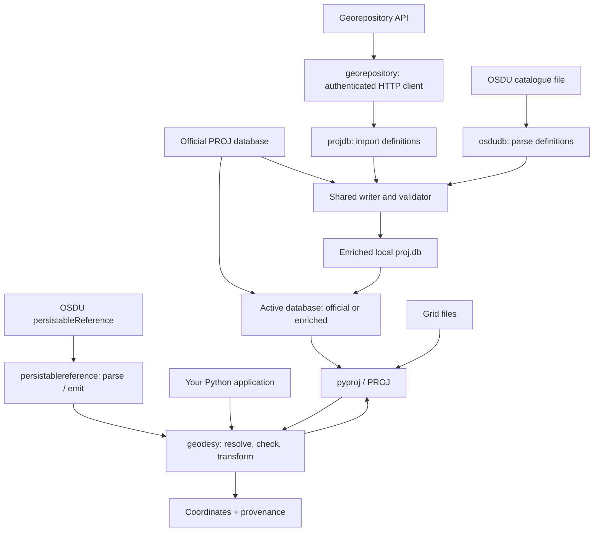

# Architecture

`geodetic-engine` is a Python library with two database-building command-line
tools. It is not a web service. PROJ does the numerical work. The package adds
explicit operation selection, quality checks, custom definitions and
provenance.

## Two separate workflows

**Build time (optional).** `geodetic-projdb` imports definitions from a
Georepository API. `geodetic-osdudb` imports a local OSDU catalogue. Both use
the shared writer to add to a copy of the official database, validate it in
staging, and publish the output atomically. The official database is never
modified in place. See {doc}`/user-guide/projdb`.

**Runtime.** An application calls
{func}`~geodetic_engine.geodesy.transform` or reuses a
{class}`~geodetic_engine.geodesy.Transformation`. The library resolves CRSs and
operations against the active database, checks the requested transformation,
and runs it through pyproj/PROJ. Results include the coordinates, the applied
operation, grid information, the coordinate epoch and database fingerprints.

A custom database is not needed for ordinary EPSG definitions. When custom
definitions are needed, distribute the enriched database and any grids it
needs, then put it on PROJ's data search path. Runtime transformations never
contact the Georepository.

OSDU payloads skip the database entirely. A `persistableReference` states its
definition in full, so
{mod}`~geodetic_engine.persistablereference` builds the CRS or operation
straight from it.

## Packages

| Package | Responsibility |
| --- | --- |
| {mod}`geodetic_engine.geodesy` | Public transformation API, CRS handling, operation checks, result provenance, projection factors |
| {mod}`geodetic_engine.geodesy.utils` | Helmert composition and collapse, abridged-transformation unit fixes |
| {mod}`geodetic_engine.welltrajectory` | Directional surveys, minimum curvature, georeferencing in a CRS through `geodesy`, 3D plots |
| {mod}`geodetic_engine.persistablereference` | OSDU `persistableReference` and ESRI WKT reading and writing |
| {mod}`geodetic_engine.georepository` | Authentication, HTTP requests, pagination, response caching |
| {mod}`geodetic_engine.projdb` | Georepository import, and the shared database writer, schema check, validation and build report |
| {mod}`geodetic_engine.osdudb` | OSDU catalogue parsing and definition recovery, on the shared database infrastructure |
| {mod}`geodetic_engine.errors` | The root exception every package error derives from |
