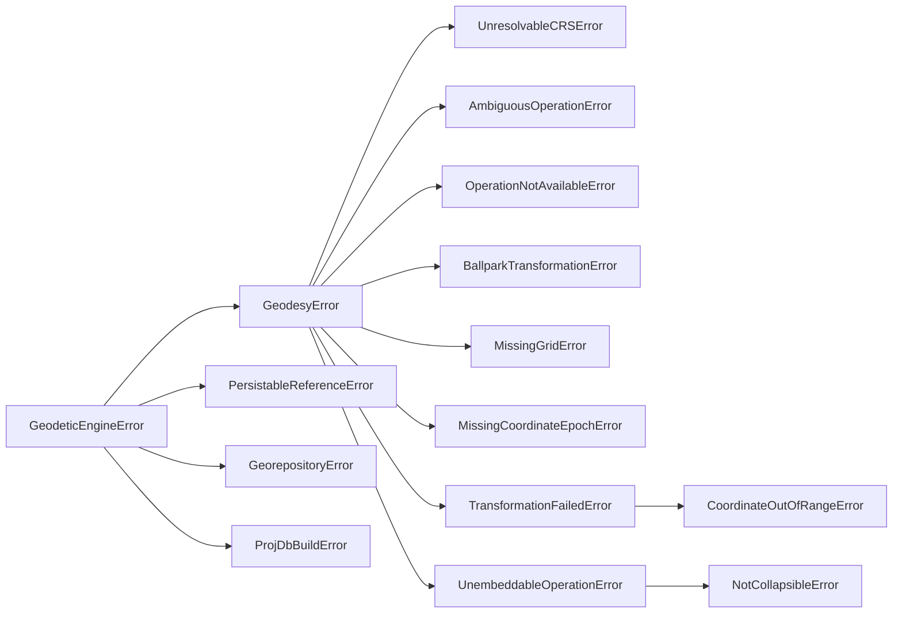

# Errors and refusals

```{code-cell} python
:tags: [remove-cell]

%xmode Minimal
```

A refusal here is never a bug to work around. Each one stops a coordinate that
might be wrong, and each exception type names a different reason. Catch
{class}`~geodetic_engine.geodesy.GeodesyError` for all of them, or a specific
subclass to handle one case.

## The hierarchy



Everything the package raises on purpose derives from
{class}`~geodetic_engine.errors.GeodeticEngineError`. The exceptions are
`TypeError` and `ValueError` for malformed arguments, such as points with the
wrong number of values.

## When each is raised, with an example

### `UnresolvableCRSError`

The CRS input cannot be turned into a CRS. The message says why. For a CRS a
custom database build left out, it gives the reason recorded at build time
rather than "not found".

```{code-cell} python
:tags: [raises-exception]

from geodetic_engine.geodesy import Transformation

Transformation("EPSG:not-a-crs", "EPSG:4326")
```

### `AmbiguousOperationError`

A datum change with no operation named. Name one; {doc}`choosing-operations`
shows how to choose. `allow_any_operation=True` no longer bypasses this. The
keyword is accepted only so older calls do not break.

```{code-cell} python
:tags: [raises-exception]

Transformation("EPSG:4230", "EPSG:4326")
```

### `OperationNotAvailableError`

The named operation cannot be applied between these CRSs, or does not exist.
This package raises rather than let PROJ substitute another operation:

```{code-cell} python
:tags: [raises-exception]

# EPSG:1133 is ED50 -> WGS 84; it has nothing to do with WGS 84 -> World Mercator.
Transformation("EPSG:4326", "EPSG:3395", operation="EPSG:1133")
```

```{code-cell} python
:tags: [raises-exception]

Transformation("EPSG:4326", "EPSG:3395", operation="EPSG:99999999")
```

### `BallparkTransformationError`

The only path PROJ can build is a ballpark approximation. With stock EPSG data
this is usually pre-empted: a pair with no real transformation is also a datum
change with nothing to name, so `AmbiguousOperationError` comes first. Either
way, no approximate coordinate is returned:

```{code-cell} python
:tags: [raises-exception]

# Puerto Rico datum -> GDA94: PROJ knows no transformation, only a ballpark.
Transformation("EPSG:4139", "EPSG:4283")
```

`BallparkTransformationError` is a last check. It is raised if the pipeline
PROJ built turns out to be a ballpark after every other check passed. Stock
EPSG data rarely gets this far.

(missing-grid-error)=

### `MissingGridError`

The operation reads a grid file that is not installed. PROJ alone would fall
back to another operation without saying so. This package names the grid and
stops. To show it, PROJ is temporarily pointed at a directory holding
`proj.db` but no grids, simulating a machine without `proj-data`:

```{code-cell} python
:tags: [raises-exception]

import os
import shutil
import tempfile
from pathlib import Path

import pyproj

installed = pyproj.datadir.get_data_dir()
bare = Path(tempfile.mkdtemp()) / "proj-without-grids"
bare.mkdir()
shutil.copy(Path(installed) / "proj.db", bare / "proj.db")

pyproj.datadir.set_data_dir(str(bare))
try:
    Transformation("EPSG:4979", "EPSG:3855", operation="EPSG:3858")
finally:
    pyproj.datadir.set_data_dir(installed)
```

Install the named grid (`projsync --file us_nga_egm08_25.tif`) and the same
call succeeds. {func}`~geodetic_engine.geodesy.available_operations` shows
each candidate's grids with `available` flags, so you can check before
transforming.

(missing-epoch-error)=

### `MissingCoordinateEpochError`

The operation reads a coordinate epoch and none was given, or the one given is
not finite:

```{code-cell} python
:tags: [raises-exception]

tfm = Transformation("EPSG:4896", "EPSG:4938", operation="EPSG:6277")
tfm.transform([(-2593197.524, 5656917.6189, -1394397.8828)])
```

This is raised by `transform()`, not by the constructor: whether an epoch is
needed is known up front (`tfm.requires_epoch`), but the epoch is given per
batch.

### `CoordinateOutOfRangeError`

A latitude outside the range its axis unit allows, checked before PROJ is
called. The usual cause is passing projected metres to a geographic CRS. The
limit comes from the axis unit, so for a CRS in grads it is ±100, not ±90.

```{code-cell} python
:tags: [raises-exception]

tfm = Transformation("EPSG:4230", "EPSG:4326", operation="EPSG:1612")
tfm.transform(590000, 6700000)  # UTM metres handed to a geographic CRS
```

It is a subclass of `TransformationFailedError`, so code catching that still
works.

### `TransformationFailedError`

PROJ ran and could not produce a finite value for every point and every
target axis. The message includes PROJ's own error.

### `UnembeddableOperationError` and `NotCollapsibleError`

Raised when an operation must be written as the single, unit-less
`ABRIDGEDTRANSFORMATION` a bound CRS carries and cannot be. You see these when
building bound CRSs: through
{doc}`/user-guide/persistable-reference`, a {doc}`custom database build
</user-guide/projdb>`, or directly through {doc}`helmert`:

```{code-cell} python
:tags: [raises-exception]

from pyproj.crs import CoordinateOperation

from geodetic_engine.geodesy.utils import collapse_concatenated

collapse_concatenated(CoordinateOperation.from_epsg(1612))  # a single step: nothing to collapse
```

## Errors from other modules

| Module | Base class | Raised for |
|---|---|---|
| `persistablereference` | {class}`~geodetic_engine.persistablereference.PersistableReferenceError` | Malformed payloads, unsupported methods, unresolvable grids ({doc}`/user-guide/persistable-reference`) |
| `georepository` | {class}`~geodetic_engine.georepository.GeorepositoryError` | Configuration, authentication, HTTP, truncated pagination ({doc}`/user-guide/georepository`) |
| `projdb`, `osdudb` | {class}`~geodetic_engine.projdb.ProjDbBuildError` | Anything that stops a database build ({doc}`/user-guide/projdb`) |
