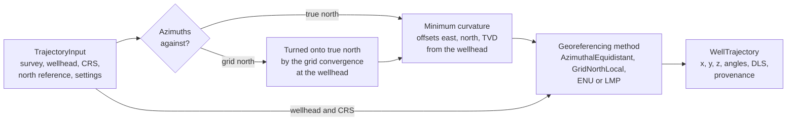

# Well trajectories

`geodetic_engine.welltrajectory` positions a wellbore from its directional
survey. The survey gives, at each station, the {term}`measured depth <Measured
depth (MD)>`, the {term}`inclination` and the {term}`azimuth <Survey azimuth>`
of the hole. With a wellhead and a CRS, the module computes easting and
northing (or longitude and latitude), elevation and {term}`dogleg severity
<Dogleg severity (DLS)>` at every station and anywhere between them.

The survey is reduced to offsets from the wellhead by the
{term}`minimum curvature` method, and the offsets are georeferenced in the CRS
by one of four methods. Every coordinate change goes through
{mod}`geodetic_engine.geodesy`, on the CRS's own datum, so no datum shift is
ever applied without being named.

**Use it when** you need positions along a well in a CRS, and need to be able
to say how they were computed: which method georeferenced them, on which
datum, with which grid convergence.

**It does not cover** survey error models and uncertainty (ISCWSA),
anti-collision, magnetic declination, a grid convergence that varies across
the well for grid azimuths, or vertical datums beyond the stated assumption
that the wellhead elevation stands in for its ellipsoidal height in the `ENU`
method.

## How a trajectory is computed



## The API in one table

| You want to | Use |
|---|---|
| Gather the survey, wellhead, CRS and settings, from arrays, rows, a DataFrame, a survey file or an OSDU request body | {class}`~geodetic_engine.welltrajectory.TrajectoryInput` |
| Compute the trajectory | {meth}`TrajectoryInput.compute <geodetic_engine.welltrajectory.TrajectoryInput.compute>`, or {func}`~geodetic_engine.welltrajectory.compute_trajectory` with the parts given separately |
| Save an input as a survey file | {meth}`TrajectoryInput.to_csv <geodetic_engine.welltrajectory.TrajectoryInput.to_csv>` |
| State the survey stations and their units on their own | {class}`~geodetic_engine.welltrajectory.Survey` |
| Read positions, angles, depths and dogleg severity | {class}`~geodetic_engine.welltrajectory.WellTrajectory` |
| Get points between the stations, on the arcs | {meth}`WellTrajectory.interpolate <geodetic_engine.welltrajectory.WellTrajectory.interpolate>`, {meth}`WellTrajectory.resample <geodetic_engine.welltrajectory.WellTrajectory.resample>` |
| Move the positions to another CRS, such as WGS 84 | {meth}`WellTrajectory.to_geographic <geodetic_engine.welltrajectory.WellTrajectory.to_geographic>` |
| Run minimum curvature without a CRS | {class}`~geodetic_engine.welltrajectory.MinimumCurvature` |
| Choose how the offsets are georeferenced in the CRS | {class}`~geodetic_engine.welltrajectory.Method` |
| Look at the wells in 3D | {func}`~geodetic_engine.welltrajectory.plot_trajectory`, {func}`~geodetic_engine.welltrajectory.open_in_browser` |
| Convert a unit name into metres or radians | {func}`~geodetic_engine.welltrajectory.length_factor`, {func}`~geodetic_engine.welltrajectory.angle_factor` |

## Conventions

| Quantity | Convention |
|---|---|
| Coordinate values | `xy` order, as everywhere in this package: easting then northing, or longitude then latitude, in the CRS's own units. |
| Inclination $I$ | From vertical: 0 is straight down, 90 is horizontal. |
| Azimuth $\alpha$ | Clockwise from north, against grid north (`"GN"`) or true north (`"TN"`). |
| Grid convergence | $\gamma$, from true north to grid north, clockwise positive: $\alpha_{grid} = \alpha_{true} - \gamma$. This needs a conformal projection. See {doc}`/user-guide/geodesy/projection-factors`. |
| Offsets | `east`, `north` and `tvd` from the wellhead, against true north, TVD positive down, in `z_unit`. |
| Elevation | $z = z_0 - \mathrm{TVD}$, with $z_0$ the wellhead elevation. The same for every method. |
| Dogleg severity | Degrees per 30 m of MD, or per 100 ft for a survey in feet. Any other length on request. |
| Units | Symbols (`m`, `ft`, `ftUS`), OSDU unit ids, or OSDU unit `persistableReference`s. |

## Rules this module enforces

1. **Units are named, never assumed.** An unknown unit, or a unit of the wrong
   quantity, raises {class}`~geodetic_engine.welltrajectory.UnitError` rather
   than defaulting: a length read in the wrong unit moves every position by a
   plausible looking amount.
2. **Nothing changes datum.** Every position is computed on the trajectory
   CRS's own datum. Moving it to another datum goes through
   {class}`~geodetic_engine.geodesy.Transformation`, so the operation must be
   named, or come with a {term}`bound CRS`, as for any other datum change.
3. **Grid azimuths need a grid.** Azimuths against grid north in a geographic
   CRS raise {class}`~geodetic_engine.geodesy.UnsupportedCRSError`, and so
   do they in a projected CRS that does not preserve angles at the wellhead,
   since grid convergence alone cannot account for angular distortion. There,
   azimuths against true north still work, without grid azimuths.
4. **Points between stations lie on the arcs.** Interpolation follows the same
   circular arcs as the stations, never straight lines between them.
5. **A survey that cannot describe a wellbore is refused**, with
   {class}`~geodetic_engine.welltrajectory.InvalidSurveyError`, or
   {class}`~geodetic_engine.welltrajectory.DegenerateSurveyError` where two
   stations point in opposite directions. An input that is incomplete or out
   of format is refused with
   {class}`~geodetic_engine.welltrajectory.InvalidInputError`, as soon as it
   is made.
6. **Every trajectory says how it was computed**, in
   {attr}`~geodetic_engine.welltrajectory.WellTrajectory.operations`.

## Pages in this section

```{toctree}
:maxdepth: 1

input
surveys
trajectories
minimum-curvature
georeferencing
plotting
```

The {doc}`well trajectory example notebook
</examples/notebooks/welltrajectory_examples>` reads the synthetic survey file,
computes, interpolates, converts and plots its trajectory, then shows each
other way to build the input, and checks a real well, Volve F-1, against its
survey report.
